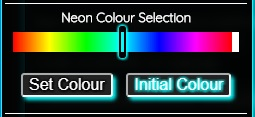

# An simple Rainbow slider colour picker

This javascript program generate 361 HUES of colour, 360 for the rainbow colour set + white, and display it on the HTML file as background-color by modifing the CSS variables 

This Rainbow slider colour picker is used on http://volfeganbox.byethost14.com/
Tested only on Edge, Chrome and Firefox.

[piles of code]

                     ,---------------------------,
                     |  /---------------------\  |
                     | |                       | |
                     | |     Computer          | |
                     | |      Services         | |
                     | |_> Use this program as | |
                     | |   as you see fit..... | |
                     |  \_____________________/  |
                     |___________________________|
                   ,---\_____     []     _______/------,
                 /         /______________\           /|
               /___________________________________ /  | ___
               |                                   |   |    )
               |  _ _ _                 [-------]  |   |   (
               |  o o o                 [-------]  |  /    _)_
               |__________________________________ |/     /  /
           /-------------------------------------/|      ( )/
         /-/-/-/-/-/-/-/-/-/-/-/-/-/-/-/-/-/-/-/ /
       /-/-/-/-/-/-/-/-/-/-/-/-/-/-/-/-/-/-/-/ /
       ~~~~~~~~~~~~~~~~~~~~~~~~~~~~~~~~~~~~~~~
    --
